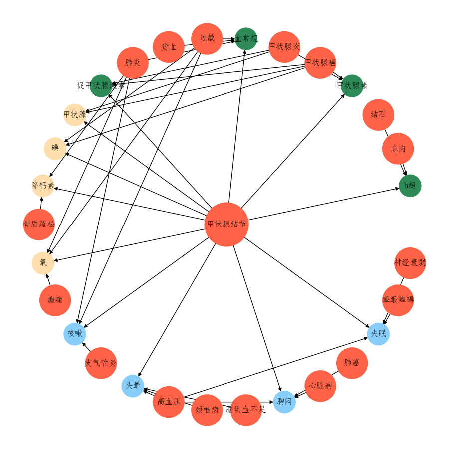

# 基于问诊数据的知识图谱构建项目
1. 数据来源

    好大夫在线、百科名医网（主要用于名词词典），数据存储于MongoDB，可用文档的结构可参考示例数据文件

2. 知识抽取
   
    主要做实体识别，分词典方法和深度学习方法，深度学习方法可选择BERT+Softmax 或 BERT+CRF，利用人工标注数据测试准确率如下：

    

3. 知识存储
   
    图模式，存储于MongoDB，文档结构如下：

    

4. 知识展示

    以某种疾病为中心，展现其最常出现的症状，最可能做的检查，最可能用的药物，以及与其他疾病之间的关系。用networkx和matplotlib完成，可视化结构如下（红色为疾病，绿色为检查，黄色为药物，蓝色为症状）：

    

    

    

